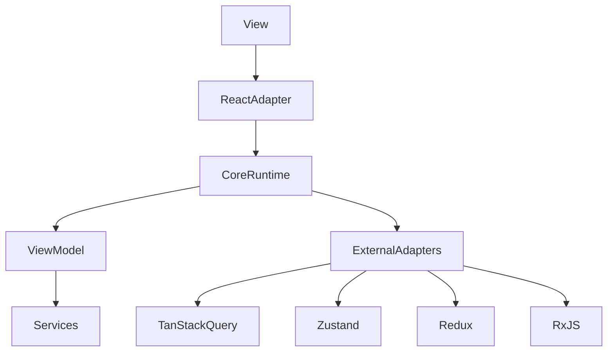

# Loom

> **Experimental API — not production ready**

Loom is an opinionated MVVM/reactivity foundation for organizing application logic in TypeScript. The core runtime is renderer-agnostic; React, TanStack Query, Zustand, Redux, and RxJS integrate through small adapter packages.



## Problem

UI frameworks excel at rendering, but application state and orchestration often leak across components. Loom keeps **ViewModels** and **services** testable without a specific renderer.

## Packages

| Package                | Purpose                                 | Status       |
| ---------------------- | --------------------------------------- | ------------ |
| `@loom/core`           | Reactive runtime & ViewModel primitives | experimental |
| `@loom/react`          | React / React Native bindings           | experimental |
| `@loom/tanstack-query` | TanStack Query adapter                  | prototype    |
| `@loom/zustand`        | Zustand adapter                         | prototype    |
| `@loom/redux`          | Redux adapter                           | prototype    |
| `@loom/rxjs`           | RxJS adapter                            | prototype    |

## Install

```bash
npm install @loom/core @loom/react
```

## Quick start

```ts
import { action, computed, defineViewModel, state } from "@loom/core";

export const CounterViewModel = defineViewModel(() => {
  const count = state(0);
  const doubled = computed(() => count.get() * 2);
  const increment = action(() => count.set(count.get() + 1));
  return {
    count,
    doubled,
    increment,
    dispose() {
      count.dispose();
      doubled.dispose();
    },
  };
});
```

```tsx
import { useExternalSource, view } from "@loom/react";
import { CounterViewModel } from "./counter.vm";

export const Counter = view(CounterViewModel, ({ vm }) => {
  const count = useExternalSource(vm.count);
  const doubled = useExternalSource(vm.doubled);
  return (
    <button type="button" onClick={vm.increment}>
      {count} / {doubled}
    </button>
  );
});
```

Proxy auto-unwrapping (`vm.count` in JSX) is planned; see [docs/roadmap.md](docs/roadmap.md).

## Development

```bash
corepack enable
pnpm install
pnpm dev:demo
pnpm check
```

Demo: `pnpm demo` — production preview: `pnpm demo:preview`

## Changesets

```bash
pnpm changeset
```

## Release dry-run

```bash
pnpm release:dry-run
```

## GitHub Pages

Enable **Settings → Pages → Source → GitHub Actions**. Demo builds with `VITE_BASE_PATH=/loom/` on main.

## Docs

- [Architecture](docs/architecture.md)
- [Reactivity](docs/reactivity.md)
- [Adapters](docs/adapters.md)
- [Releases](docs/releases.md)
- [Roadmap](docs/roadmap.md)

## Renaming the project

If you fork under a new scope, update:

- `packages/*/package.json` `name` fields
- `repository`, `homepage`, and `bugs` URLs
- Root `README.md` and demo links
- `.changeset/config.json` `ignore` entries
- GitHub Actions `VITE_BASE_PATH` / repository references

## License

MIT — see [LICENSE](LICENSE).
